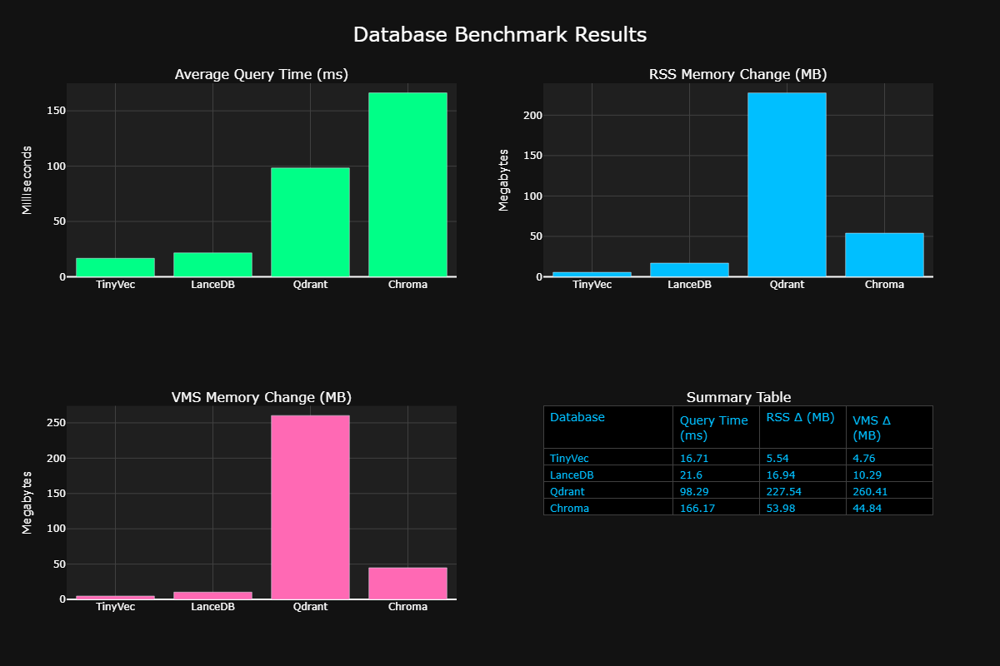

# TinyVecDB Filtered Vector Search Benchmarks

## Methodology

The following benchmarks were conducted using:

- **Environment**: Windows 11
- **Dataset Size**: 10,000 documents
- **Query Count**: 20 queries per database (10 searches with each of 2 different filters)
- **Metrics**: Average query time (ms), RSS Memory Change (MB), VMS Memory Change (MB)
- **Test Type**: Vector search with metadata filtering

## Results

| Database | Query Time (ms) | RSS Δ (MB) | VMS Δ (MB) |
| -------- | --------------- | ---------- | ---------- |
| TinyVec  | 16.71           | 5.54       | 4.76       |
| LanceDB  | 21.6            | 16.94      | 10.29      |
| Qdrant   | 98.29           | 227.54     | 260.41     |
| Chroma   | 166.17          | 53.98      | 44.84      |

## Visualization

  

_Lower values indicate better performance. TinyVecDB maintains its performance lead even when combining vector search with metadata filtering._

## Hardware Specifications

- **CPU**: AMD Ryzen 5900HS
- **RAM**: 16GB
- **OS**: Windows 11

## Conclusion

When combining vector similarity search with metadata filtering, TinyVecDB continues to demonstrate exceptional performance. It delivers query responses up to 10x faster than the slowest competitor while maintaining significantly lower memory utilization.

The results show that TinyVecDB's efficient design extends beyond pure vector searches to more complex hybrid queries. This is particularly important for real-world applications where filtering by metadata (such as categories, dates, or other attributes) is often combined with semantic similarity searches.

The minimal memory overhead during filtered searches (only 5.54MB RSS change) highlights TinyVecDB's optimized memory management even when performing more complex operations. This makes it an ideal choice for applications that need sophisticated query capabilities without sacrificing performance or resource efficiency.

_Note: Performance may vary based on hardware configuration and dataset characteristics._
