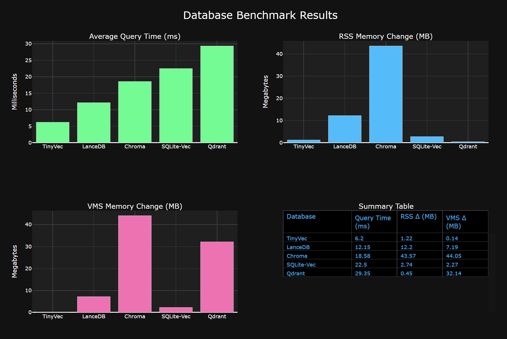

# TinyVecDB Performance Benchmarks

## Methodology

The following benchmarks were conducted using:

- **Environment**: Windows 11
- **Dataset Size**: 10,000 documents
- **Query Count**: 10 queries per database
- **Metrics**: Average query time (ms), RSS Memory Change (MB), VMS Memory Change (MB)
- **Test Type**: Pure similarity search (vector search without metadata filtering)

## Results

| Database   | Query Time (ms) | RSS Δ (MB) | VMS Δ (MB) |
| ---------- | --------------- | ---------- | ---------- |
| TinyVec    | 6.2             | 1.22       | 0.14       |
| LanceDB    | 12.15           | 12.2       | 7.19       |
| Chroma     | 18.58           | 43.57      | 44.05      |
| SQLite-Vec | 22.5            | 2.74       | 2.27       |
| Qdrant     | 29.35           | 0.45       | 32.14      |

## Visualization

  

_Lower values indicate better performance. TinyVecDB demonstrates faster query times with minimal memory impact across both RSS and VMS metrics._

## Hardware Specifications

- **CPU**: AMD Ryzen 5900HS
- **RAM**: 16GB
- **OS**: Windows 11

## Conclusion

TinyVecDB shows superior performance for similarity search operations in resource-constrained environments. The main advantage is two-fold: not only does TinyVecDB deliver the fastest query times (up to 4.7x faster than the slowest competitor), but it also maintains an exceptionally low memory footprint with minimal RSS and VMS changes during operation.

This combination of speed and memory efficiency makes TinyVecDB particularly well-suited for edge devices, embedded systems, and applications where resource utilization is critical. The minimal memory overhead (less than 1.5MB RSS change) ensures that TinyVecDB can operate effectively even in environments with strict memory constraints.

_Note: Performance may vary based on hardware configuration and dataset characteristics._
